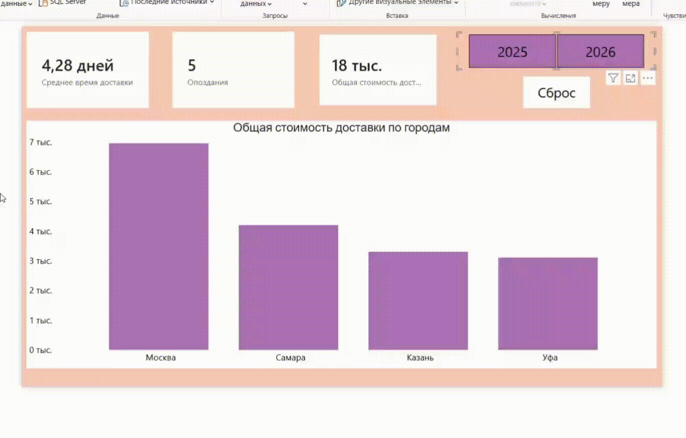

# Логистика и эффективность поставок

## Бизнес-задача
Разработать аналитический инструмент для контроля качества работы службы доставки. Основные цели: отслеживание расходов на логистику, расчет среднего времени доставки в днях, выявление проблемных регионов с наибольшим количеством опозданий и анализ эффективности различных способов доставки.

## Инструменты и методы
В данном проекте был сделан упор на продвинутое моделирование времени, нестандартные визуальные решения и сложные вычисления DAX:
* **Моделирование данных:** Создание пользовательской таблицы дат (Календаря) для непрерывной оси времени и построение связи «Один-к-одному» (1:1) между календарем и таблицей с информацией о заказах.
* **DAX:** Использование итераторов, функций генерации таблиц и модификации фильтров. *Реализованные меры:*

  *Автоматическая генерация пользовательского календаря:*
  ```dax
  Календарь = ADDCOLUMNS(CALENDARAUTO(), "Год", YEAR([Date]), "Месяц Номер", MONTH([Date]), "Месяц", FORMAT([Date], "MMMM"), "Квартал", "Кв " & FORMAT([Date], "Q"))
  ```
  *Динамический расчет среднего времени доставки в днях:*
  ```dax
  Среднее время доставки = AVERAGEX('Логистика', DATEDIFF('Логистика'[Дата заказа], 'Логистика'[Дата доставки], DAY))
  ```
  Подсчет количества срывов сроков (с обработкой пустоты для вывода нулевых показателей на графиках):
  ```dax
  Опоздания = CALCULATE(COUNTROWS('Логистика'), 'Логистика'[Статус] = "Опоздание") + 0
  ```
* **Интерфейс и UX-дизайн:** Применение пользовательских форматов данных, создание динамических всплывающих подсказок в виде скрытых страниц отчета и настройка кнопки сброса фильтров с помощью механизма Закладок.



## Вывод:
Самая высокая стоимость доставки зафиксирована в Москве, однако больше всего опозданий наблюдается в Самаре. Среднее время доставки в этот город составляет 6 дней, в то время как в другие - около 3,6 дней, при этом по уровню затрат Самара занимает второе место после Москвы. Возможно, стоит изменить способ доставки товаров в этот город, чтобы сравнить показатели «до» и «после». При этом доставка через ПВЗ за весь анализируемый период не имеет ни одного опоздания.
